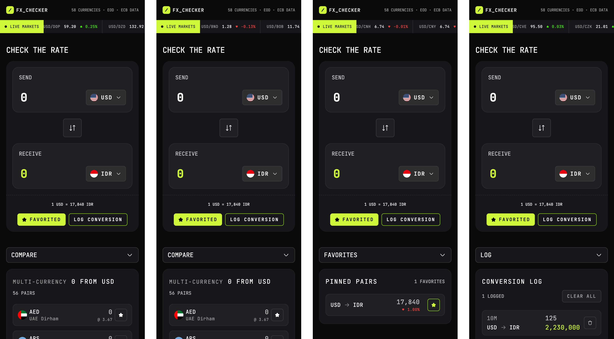
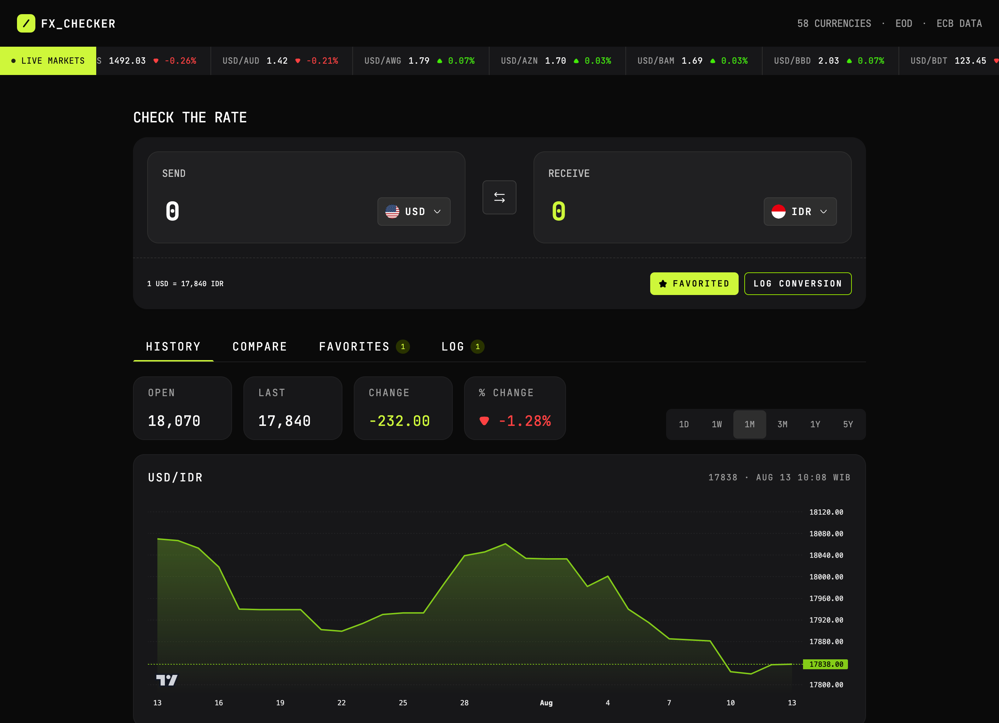
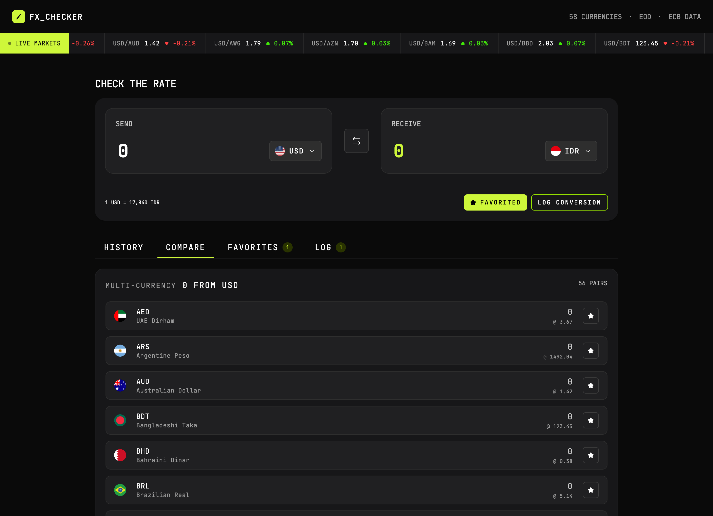
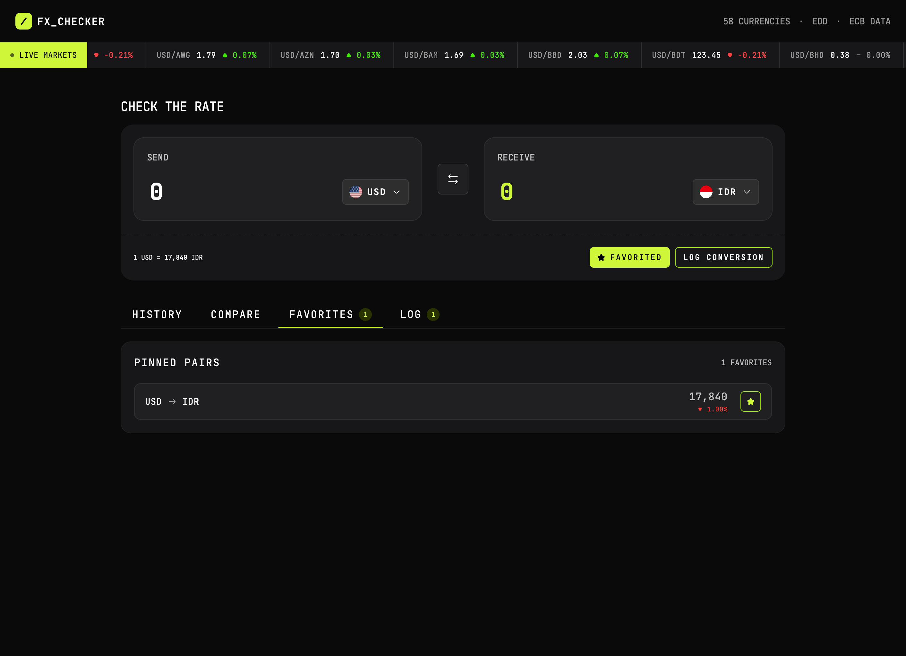
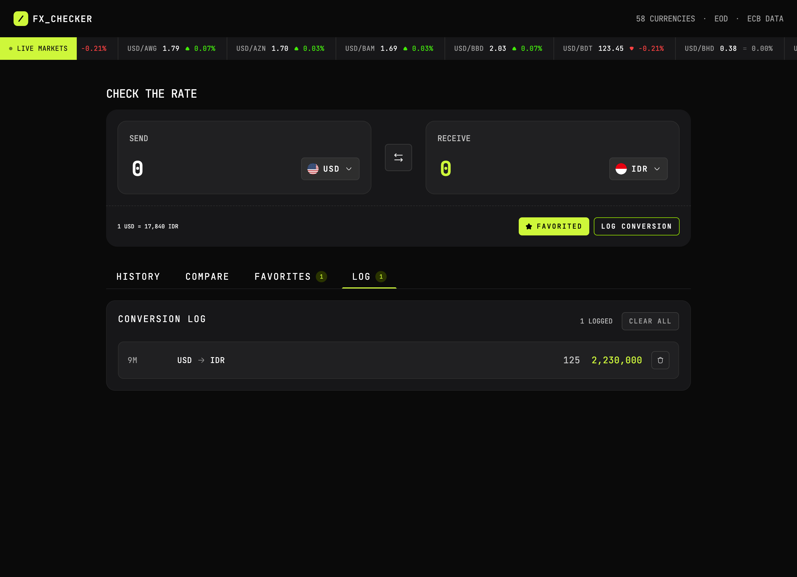

# Frontend Mentor - FX Checker solution

This is a solution to the [FX Checker challenge on Frontend Mentor](https://www.frontendmentor.io/challenges/foreign-exchange-currency-converter). Frontend Mentor challenges help you improve your coding skills by building realistic projects.

## Table of contents

- [Overview](#overview)
  - [The challenge](#the-challenge)
  - [Screenshot](#screenshot)
  - [Links](#links)
- [My process](#my-process)
  - [Built with](#built-with)
  - [Continued development](#continued-development)
- [Author](#author)

## Overview

### The challenge

Your users should be able to:

### Converter

- Enter an amount to send and see it convert in real time as they type
- Pick the "send" and "receive" currencies from a searchable currency picker
- See the live exchange rate for the active pair (for example, `1 USD = 0.8530 EUR`)
- Swap the send and receive currencies with the swap button
- Favorite the active pair, and log a conversion to their history

### Currency picker

- Search the full list of available currencies by code or name
- See currencies grouped into "Popular" and "Other currencies", each row showing the flag, code, and name
- See a check against the currency that's currently selected

### Live markets ticker

- See a ticker of currency pairs, each with its current rate and 24-hour change (up or down)

### Rate history

- View a line and area chart of the active pair's rate over time
- Switch the chart range between 1D, 1W, 1M, 3M, 1Y, and 5Y
- See the open, last, absolute change, and percentage change for the selected range

### Compare

- See their send amount converted into a range of other currencies at once, each with its reference rate
- Pin or unpin any comparison row to their favorites

### Favorites

- See their pinned pairs, each with its live rate and 24-hour change
- Load a pinned pair back into the converter by selecting its row
- Unpin a pair they no longer want to track

### Conversion log

- See a log of conversions they've made, each showing the relative time, the pair, and the send and receive amounts
- Clear the whole log
- Delete an individual entry

### UI & accessibility

- View the optimal layout for the interface depending on their device's screen size
- See hover and focus states for all interactive elements on the page
- Navigate the entire app using only their keyboard

### Screenshot

### Links

- Solution URL: [FrontendMentor post](https://your-solution-url.com)
- Live Site URL: [myfxchecker](https://myfxchecker.vercel.app/compare?base=idr&quote=usd&tab=1m)

## My process

### Built with

- React + Vite + TypeScript
- Tanstack Query
- Motion (Framer Motion)
- LightWeight Chart (TradingView)
- Tailwind CSS v4
- Zustand
- Moment.js
- Semantic HTML5 markup
- Mobile-first workflow

### Continued development

The next iteration of this app it could include:

- Add a light theme so users can switch between the dark-first design and a light alternative
- Persist the active currency pair in the URL so a conversion can be bookmarked or shared
- Add keyboard shortcuts so power users can focus the search, swap currencies, and switch the chart range without the mouse
- Export the conversion log as a CSV file
- Add a hover crosshair to the rate chart that shows the exact date and rate under the cursor
- Cache the last successful rates and fall back to them with an out-of-date banner when the API is unreachable
- Build as a full-stack app with accounts so a user's favorites and conversion log sync across devices

## Author

- Frontend Mentor - [@codesbyree](https://www.frontendmentor.io/profile/codesbyree)
- Instagram - [@ree.software](https://www.instagram.com/ree.software)
